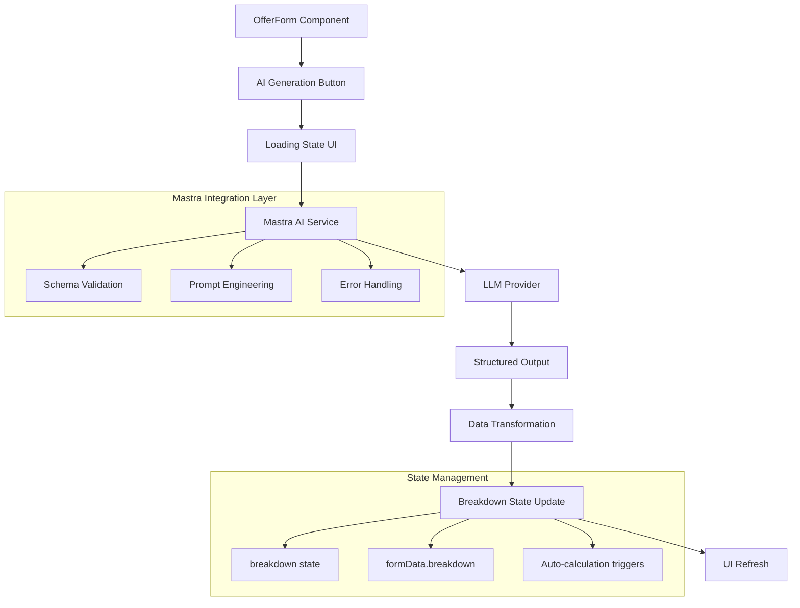
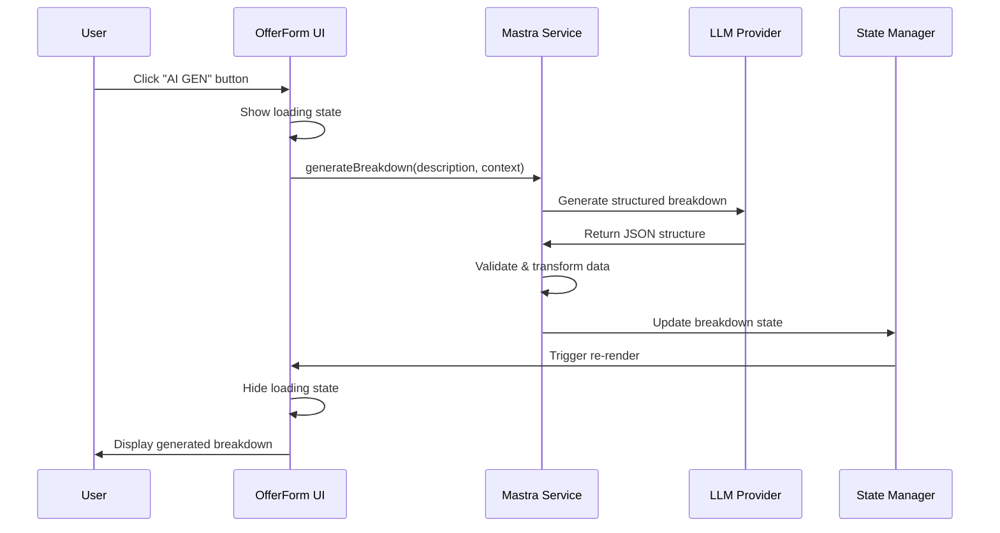

# Mastra Package Integration for AI-Powered Breakdown Generation

## Overview

This design document outlines the integration of the Mastra AI framework package into the team-status application to provide automated breakdown generation functionality. The feature will add an AI-powered "AI GEN" button alongside the existing "Add Module" button in the OfferForm component, enabling users to automatically generate structured project breakdowns with modules, subtasks, and time estimations based on project descriptions.

**Core Value Proposition:**
- Accelerate project estimation workflow by 70-80% through AI automation
- Ensure consistent breakdown structure across all project offers
- Reduce manual effort in creating detailed project breakdowns
- Maintain data integrity with the existing breakdown state management system

## Technology Stack & Dependencies

**New Dependencies to Add:**
- `@mastra/core`: Core Mastra framework for AI agent functionality
- `@ai-sdk/openai`: OpenAI integration (can be swapped for other providers)
- `zod`: Schema validation for structured outputs (already in ecosystem)

**Environment Variables:**
```env
# OpenRouter API Configuration (example)
OPENROUTER_API_KEY=your_openrouter_api_key_here
AI_MODEL_PROVIDER=openrouter
AI_MODEL_NAME=google/gemini-2.0-flash-exp
AI_MODEL_BASE_URL=https://openrouter.ai/api/v1
```

**Alternative Providers Support:**
- OpenAI (GPT-4, GPT-3.5-turbo)
- Anthropic (Claude models)
- Google (Gemini models via OpenRouter)
- Local models via Ollama

## Architecture

### Component Integration Architecture



### Data Flow Architecture



## Mastra Service Implementation

### Core AI Agent Configuration

```typescript
// src/services/mastraService.js
import { Agent } from '@mastra/core/agent';
import { openai } from '@ai-sdk/openai';
import { z } from 'zod';

// Breakdown schema matching existing data structure
const BreakdownSchema = z.object({
  modules: z.array(z.object({
    name: z.string(),
    tasks: z.array(z.object({
      name: z.string(),
      estimation: z.string(), // Format: "1d 4h", "48h", "1w", etc.
    }))
  }))
});

const breakdownAgent = new Agent({
  name: "Project Breakdown Generator",
  instructions: `You are a project estimation expert that creates detailed breakdowns for software development projects.
  
  Your task is to analyze project descriptions and generate structured breakdowns with:
  - Logical modules (Development, Testing, Bugfixing are common, but adapt based on project type)
  - Detailed tasks within each module
  - Realistic time estimations in formats like "1d 4h", "48h", "1w", "30m"
  
  Always include Testing and Bugfixing modules with 15-25% of total development time.
  Consider project complexity, technology stack, and typical development patterns.`,
  
  model: getModelFromEnv(),
  outputSchema: BreakdownSchema,
});
```

### Environment-Based Model Configuration

```typescript
// src/services/modelConfig.js
function getModelFromEnv() {
  const provider = process.env.AI_MODEL_PROVIDER || 'openai';
  const modelName = process.env.AI_MODEL_NAME || 'gpt-4o-mini';
  
  switch (provider) {
    case 'openrouter':
      return openai(modelName, {
        baseURL: process.env.AI_MODEL_BASE_URL,
        apiKey: process.env.OPENROUTER_API_KEY,
      });
    case 'openai':
      return openai(modelName);
    default:
      throw new Error(`Unsupported AI provider: ${provider}`);
  }
}
```

### Breakdown Generation Service

```typescript
// src/services/breakdownGenerator.js
class BreakdownGeneratorService {
  async generateBreakdown(projectDescription, clientInfo = '', existingEmployees = []) {
    try {
      const context = this.buildContext(projectDescription, clientInfo, existingEmployees);
      
      const result = await breakdownAgent.text(context);
      const parsedResult = JSON.parse(result);
      
      // Transform to match existing state structure
      return this.transformToStateFormat(parsedResult.modules);
    } catch (error) {
      console.error('Breakdown generation failed:', error);
      throw new Error('Failed to generate breakdown. Please try again.');
    }
  }
  
  buildContext(description, clientInfo, employees) {
    return `Project Description: ${description}
    
    ${clientInfo ? `Client: ${clientInfo}` : ''}
    ${employees.length ? `Team Members: ${employees.join(', ')}` : ''}
    
    Generate a detailed project breakdown with modules and tasks. Include realistic time estimates.`;
  }
  
  transformToStateFormat(modules) {
    return modules.map(module => ({
      name: module.name,
      tasks: module.tasks.map(task => ({
        name: task.name,
        estimation: task.estimation,
        id: Date.now() + Math.random() // Generate unique ID
      }))
    }));
  }
}
```

## UI Component Enhancement

### Enhanced OfferForm with AI Generation

```jsx
// Enhanced OfferForm.jsx sections
import { BreakdownGeneratorService } from '../services/breakdownGenerator.js';

function OfferForm(props) {
  // Existing state...
  const [isGenerating, setIsGenerating] = useState(false);
  const [generationError, setGenerationError] = useState(null);
  const breakdownGenerator = new BreakdownGeneratorService();

  const handleAIGeneration = async () => {
    if (!formData.description?.trim()) {
      alert('Please enter a project description first');
      return;
    }

    setIsGenerating(true);
    setGenerationError(null);

    try {
      const clientName = clients.find(c => c.id === formData.clientId)?.name || '';
      const employeeNames = selectedEmployees.map(id => 
        employees.find(e => e.id === id)?.name
      ).filter(Boolean);

      const generatedBreakdown = await breakdownGenerator.generateBreakdown(
        formData.description,
        clientName,
        employeeNames
      );

      // Update breakdown state
      setBreakdown(generatedBreakdown);
      setFormData(prev => ({
        ...prev,
        breakdown: JSON.stringify(generatedBreakdown)
      }));

    } catch (error) {
      setGenerationError(error.message);
    } finally {
      setIsGenerating(false);
    }
  };

  // Enhanced button section in render
  return (
    <form className="offer-form" onSubmit={handleSubmit}>
      {/* Existing form fields... */}
      
      {/* Enhanced Breakdown Section */}
      <div className="form-group">
        <div className="breakdown-header">
          <label>Project Breakdown:</label>
          <div className="breakdown-controls">
            <button
              type="button"
              className="btn-secondary"
              onClick={addModule}
              disabled={isGenerating}
            >
              Add Module
            </button>
            <button
              type="button"
              className={`btn-ai-gen ${isGenerating ? 'loading' : ''}`}
              onClick={handleAIGeneration}
              disabled={isGenerating || !formData.description?.trim()}
            >
              {isGenerating ? (
                <>
                  <span className="spinner"></span>
                  Generating...
                </>
              ) : (
                <>
                  <span className="ai-icon">✨</span>
                  AI GEN
                </>
              )}
            </button>
          </div>
        </div>
        
        {generationError && (
          <div className="error-message">
            {generationError}
            <button 
              type="button" 
              className="retry-btn"
              onClick={handleAIGeneration}
            >
              Retry
            </button>
          </div>
        )}
        
        {/* Existing breakdown rendering... */}
      </div>
    </form>
  );
}
```

### UI Styling Enhancements

```css
/* src/components/OfferForm.css additions */
.breakdown-header {
  display: flex;
  justify-content: space-between;
  align-items: center;
  margin-bottom: 1rem;
}

.breakdown-controls {
  display: flex;
  gap: 0.75rem;
}

.btn-ai-gen {
  background: linear-gradient(135deg, #667eea 0%, #764ba2 100%);
  color: white;
  border: none;
  padding: 0.5rem 1rem;
  border-radius: 6px;
  font-weight: 500;
  cursor: pointer;
  display: flex;
  align-items: center;
  gap: 0.5rem;
  transition: all 0.3s ease;
  position: relative;
  overflow: hidden;
}

.btn-ai-gen:hover:not(:disabled) {
  transform: translateY(-2px);
  box-shadow: 0 4px 12px rgba(102, 126, 234, 0.4);
}

.btn-ai-gen:disabled {
  opacity: 0.7;
  cursor: not-allowed;
  transform: none;
}

.btn-ai-gen.loading {
  background: linear-gradient(135deg, #9bb5ff 0%, #a788c7 100%);
}

.ai-icon {
  font-size: 1.1em;
  animation: sparkle 2s ease-in-out infinite;
}

.spinner {
  width: 16px;
  height: 16px;
  border: 2px solid transparent;
  border-top: 2px solid white;
  border-radius: 50%;
  animation: spin 1s linear infinite;
}

@keyframes sparkle {
  0%, 100% { transform: scale(1) rotate(0deg); }
  50% { transform: scale(1.1) rotate(180deg); }
}

@keyframes spin {
  0% { transform: rotate(0deg); }
  100% { transform: rotate(360deg); }
}

.error-message {
  background: #fee;
  border: 1px solid #fcc;
  color: #c33;
  padding: 0.75rem;
  border-radius: 4px;
  margin-bottom: 1rem;
  display: flex;
  justify-content: space-between;
  align-items: center;
}

.retry-btn {
  background: #c33;
  color: white;
  border: none;
  padding: 0.25rem 0.5rem;
  border-radius: 3px;
  cursor: pointer;
  font-size: 0.875rem;
}
```

## Detailed Implementation Tasklist

### Phase 1: Environment & Dependencies Setup
**Estimation: 4h**

1. **Package Installation** (1h)
   - [ ] Install `@mastra/core` package via bun
   - [ ] Install `@ai-sdk/openai` for model integration
   - [ ] Verify zod is available (should be in dependencies)
   - [ ] Update package.json with new dependencies

2. **Environment Configuration** (1h)
   - [ ] Create `.env.example` with AI provider configuration template
   - [ ] Add environment variables to .gitignore if not already there
   - [ ] Document environment setup in README.md
   - [ ] Create environment validation utility

3. **Model Configuration Service** (2h)
   - [ ] Create `src/services/modelConfig.js` for provider abstraction
   - [ ] Implement OpenRouter/Gemini configuration
   - [ ] Add fallback configurations for other providers
   - [ ] Add environment validation and error handling

### Phase 2: Core Mastra Integration
**Estimation: 8h**

4. **Schema Definition** (2h)
   - [ ] Define Zod schema matching existing breakdown structure
   - [ ] Add validation for time format patterns
   - [ ] Create transformation utilities for data mapping
   - [ ] Add comprehensive error handling

5. **AI Agent Implementation** (3h)
   - [ ] Create `src/services/mastraService.js`
   - [ ] Implement project breakdown agent with detailed prompts
   - [ ] Configure structured output generation
   - [ ] Add context building logic for project descriptions

6. **Breakdown Generator Service** (3h)
   - [ ] Create `BreakdownGeneratorService` class
   - [ ] Implement `generateBreakdown()` method with error handling
   - [ ] Add data transformation to match state format
   - [ ] Create context enhancement for better AI understanding

### Phase 3: UI Integration & Enhancement
**Estimation: 6h**

7. **OfferForm Component Enhancement** (4h)
   - [ ] Add AI generation state management (loading, error states)
   - [ ] Implement `handleAIGeneration` function
   - [ ] Add AI GEN button with loading states
   - [ ] Integrate error handling and user feedback

8. **Button Styling & Animation** (2h)
   - [ ] Create animated AI GEN button with gradient background
   - [ ] Implement loading spinner and sparkle animations
   - [ ] Add hover effects and disabled states
   - [ ] Ensure mobile responsiveness

### Phase 4: Integration & Data Flow
**Estimation: 4h**

9. **State Management Integration** (2h)
   - [ ] Ensure generated breakdown integrates with existing state
   - [ ] Verify auto-calculation triggers work with generated data
   - [ ] Test integration with existing add/remove module functions
   - [ ] Validate data persistence through form submission

10. **Error Handling & User Experience** (2h)
    - [ ] Add comprehensive error messages for API failures
    - [ ] Implement retry functionality for failed generations
    - [ ] Add validation for required fields before generation
    - [ ] Create user guidance for optimal prompt descriptions

### Phase 5: Testing & Validation
**Estimation: 6h**

11. **Unit Testing** (3h)
    - [ ] Test breakdown generation service with various inputs
    - [ ] Test data transformation utilities
    - [ ] Test error handling scenarios
    - [ ] Test UI state management during generation process

12. **Integration Testing** (2h)
    - [ ] Test complete workflow from button click to state update
    - [ ] Verify auto-calculation works with generated data
    - [ ] Test form submission with AI-generated breakdowns
    - [ ] Validate API error handling

13. **User Acceptance Testing** (1h)
    - [ ] Test with various project description types
    - [ ] Verify estimation quality and realism
    - [ ] Test button responsiveness and loading states
    - [ ] Validate error recovery mechanisms

### Phase 6: Documentation & Bugfixing
**Estimation: 2h**

14. **Documentation** (1h)
    - [ ] Update README with AI generation features
    - [ ] Document environment setup requirements
    - [ ] Create usage guidelines for optimal results
    - [ ] Add troubleshooting guide

15. **Bugfixing & Polish** (1h)
    - [ ] Fix any discovered issues during testing
    - [ ] Optimize loading states and animations
    - [ ] Refine error messages for clarity
    - [ ] Final validation of all functionality

**Total Estimation: 30h**

## Data Structure Integration

### Existing Breakdown State Structure
```javascript
// Current breakdown format in state
const breakdown = [
  {
    name: "Development",
    tasks: [
      {
        id: 1234567890,
        name: "Database Setup",
        estimation: "1d 4h"
      }
    ]
  }
];
```

### AI Generated Output Transformation
```javascript
// AI output format -> State format transformation
const transformAIOutput = (aiModules) => {
  return aiModules.map(module => ({
    name: module.name,
    tasks: module.tasks.map(task => ({
      id: Date.now() + Math.random(), // Generate unique ID
      name: task.name,
      estimation: task.estimation // Already in correct format
    }))
  }));
};
```

## Error Handling Strategy

### API Error Scenarios
1. **Network Failures**: Retry mechanism with exponential backoff
2. **Invalid API Keys**: Clear error message with setup instructions
3. **Rate Limiting**: Queue requests and inform user of delays
4. **Malformed Responses**: Fallback to manual breakdown creation

### User Experience Fallbacks
- Disable AI GEN button when description is empty
- Show clear loading states with progress indication
- Provide retry button for failed generations
- Maintain existing manual workflow as backup

## Testing Strategy

### Unit Tests
- Breakdown generation service with mocked AI responses
- Data transformation utilities
- Error handling scenarios
- UI state management

### Integration Tests
- Complete AI generation workflow
- State synchronization with existing breakdown management
- Form submission with AI-generated data
- Auto-calculation integration

### User Acceptance Criteria
- Generate realistic breakdowns from project descriptions
- Maintain existing breakdown editing functionality
- Provide clear feedback during generation process
- Handle errors gracefully without breaking form functionality

## Future Enhancements

### Advanced Features
- **Smart Context Detection**: Analyze existing project data for better generation
- **Learning from Feedback**: Track user modifications to improve future generations
- **Template-Based Generation**: Pre-configured breakdown templates for common project types
- **Estimation Calibration**: Learn from actual project completion times

### Integration Opportunities
- **Project History Analysis**: Use past projects to inform new estimates
- **Team Velocity Integration**: Adjust estimates based on team performance data
- **Client-Specific Patterns**: Learn client preferences for breakdown structures