# Offer Breakdown Time Parser Design

## Overview

This feature enhances the offer breakdown functionality by implementing intelligent time parsing and automatic estimation calculation. The system will parse time estimation inputs in various formats (minutes, hours, days, weeks) across all breakdown modules and tasks, automatically calculating a total estimation for the entire offer.

## Architecture

### Time Parsing Engine

The core component is a time parsing utility that converts human-readable time formats into a standardized internal representation (minutes) for calculation purposes.

```mermaid
flowchart TD
    A[User Input: "1d 4h"] --> B[Time Parser]
    B --> C[Parse Components]
    C --> D[Convert to Minutes]
    D --> E[Return Standardized Value]
    E --> F[Calculate Total]
    F --> G[Update Main Estimation Field]
```

### Supported Time Formats

| Format | Description | Examples | Conversion |
|--------|-------------|----------|------------|
| `Xm` | Minutes | "30m", "45m" | Direct minutes |
| `Xh` | Hours | "2h", "8h" | X * 60 minutes |
| `Xd` | Days | "1d", "5d" | X * 8 * 60 minutes (8-hour workday) |
| `Xw` | Weeks | "1w", "2w" | X * 5 * 8 * 60 minutes (5-day workweek) |
| Combined | Multiple units | "1d 4h", "2w 3d" | Sum of all components |

### Enhanced Breakdown Structure

The existing breakdown structure will be extended to include dedicated modules for testing and bugfixing, with intelligent estimation parsing across all components.

```mermaid
classDiagram
    class OfferBreakdown {
        +modules: Module[]
        +getTotalEstimation(): number
        +parseTimeInput(input: string): number
    }
    
    class Module {
        +name: string
        +tasks: Task[]
        +estimation?: string
        +getModuleTotal(): number
    }
    
    class Task {
        +name: string
        +estimation: string
        +getTaskEstimation(): number
    }
    
    class TimeParser {
        +parseTimeString(input: string): number
        +formatMinutesToReadable(minutes: number): string
        +validateTimeFormat(input: string): boolean
    }
    
    OfferBreakdown --> Module
    Module --> Task
    OfferBreakdown --> TimeParser
```



## Component Modifications

### Enhanced OfferForm Component

The OfferForm component will be enhanced with:

1. **Time Parsing Integration**: Real-time parsing of estimation inputs
2. **Auto-calculation**: Automatic total estimation calculation
3. **Default Module Creation**: Pre-populated testing and bugfixing modules
4. **Validation**: Input validation for time format

### New Time Parser Utility

Location: `src/utils/timeParser.js`

```mermaid
graph LR
    A[Input: "1w 2d 4h"] --> B[Regex Parsing]
    B --> C[Extract Components]
    C --> D[Convert Each Unit]
    D --> E[Sum Total Minutes]
    E --> F[Return Numeric Value]
```

**Core Functions:**
- `parseTimeString(input)`: Converts time string to minutes
- `formatMinutesToReadable(minutes)`: Converts minutes back to readable format
- `validateTimeFormat(input)`: Validates input format
- `calculateTotalEstimation(breakdown)`: Calculates total from all modules/tasks

### Enhanced Task Structure

Each task will support the enhanced estimation parsing:


## Module Management Enhancements

### Default Module Creation

When creating a new offer breakdown, the system will automatically include:

1. **Development Module**: For core development tasks
2. **Testing Module**: For QA and testing activities  
3. **Bugfixing Module**: For bug resolution and fixes

### Module-Level Estimation

Each module can have an optional estimation field that contributes to the total calculation alongside individual task estimations.


## Real-time Calculation Logic

### Estimation Aggregation Flow


### Calculation Rules

1. **Task-level**: Individual task estimations are parsed and stored
2. **Module-level**: Sum of all tasks + optional module overhead
3. **Breakdown-level**: Sum of all modules
4. **Auto-update**: Any estimation change triggers total recalculation
5. **Format preservation**: Display totals in most appropriate unit (prefer days/weeks for large values)

## User Interface Enhancements

### Enhanced Input Fields

All estimation input fields will feature:

- **Placeholder text**: "e.g., 1d 4h, 48h, 2w"
- **Real-time validation**: Visual feedback for valid/invalid formats
- **Auto-completion**: Format suggestions as user types
- **Error handling**: Clear error messages for invalid inputs

### Visual Feedback


### Total Estimation Display

The main estimation field will:
- Display auto-calculated total in readable format
- Show breakdown of calculation on hover/focus
- Allow manual override if needed
- Highlight when auto-calculated vs manually entered

## Data Flow Architecture

### State Management


### Event Handling

1. **onEstimationChange**: Triggered when any estimation field changes
2. **validateAndParse**: Real-time validation and parsing
3. **recalculateTotal**: Aggregates all estimations
4. **updateMainEstimation**: Updates the primary estimation field
5. **formatDisplay**: Formats the total for display

## Error Handling & Validation

### Input Validation

The system will validate time inputs using regex patterns:

```regex
/^(\d+w\s*)?(\d+d\s*)?(\d+h\s*)?(\d+m\s*)?$/
```

### Error States

| Error Type | Message | Resolution |
|------------|---------|------------|
| Invalid Format | "Please use format like '1d 4h' or '48h'" | Show format examples |
| Empty Input | No error (optional field) | Allow empty values |
| Excessive Duration | "Duration seems unusually long" | Warning, but allow |

### Fallback Behavior

- Invalid inputs default to 0 for calculation purposes
- Maintain original input text for user correction
- Graceful degradation if parsing fails

## Testing Strategy

### Unit Tests

1. **Time Parser Tests**
   - Valid format parsing
   - Invalid format handling
   - Edge cases (0 values, large numbers)
   - Combined format parsing

2. **Calculation Tests**
   - Single task calculation
   - Module aggregation
   - Breakdown totaling
   - Auto-update triggers

3. **Component Tests**
   - Input validation feedback
   - State synchronization
   - Event handling
   - UI updates

### Integration Tests

1. **End-to-End Workflow**
   - Create offer with breakdown
   - Add tasks with estimations
   - Verify auto-calculation
   - Modify estimations and verify updates

2. **Cross-Module Interaction**
   - Testing module creation
   - Bugfixing module creation
   - Mixed estimation formats
   - Total calculation accuracy